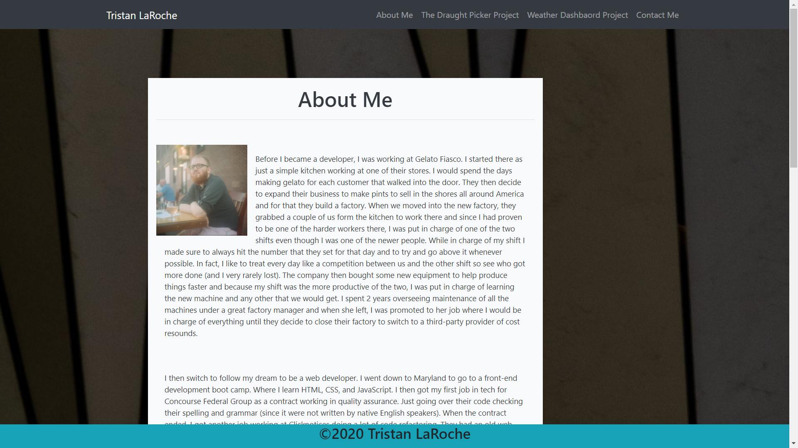

# Responsive-Portfolio

## Overview

This is a responsive portfolio that I made with bootstrap. The first section is an about me that tells the story of my career in coding and how I got into it. The next section shows off the draft picker website that I made with a group. Then my next section shows off the weather dashboard website that I made by myself. Then there is an contact section that has my phone number, current address and links to my email, linkedin, and github page. 

## Link

https://taroche.github.io/Responsive-Portfolio/index.html

## My Page

